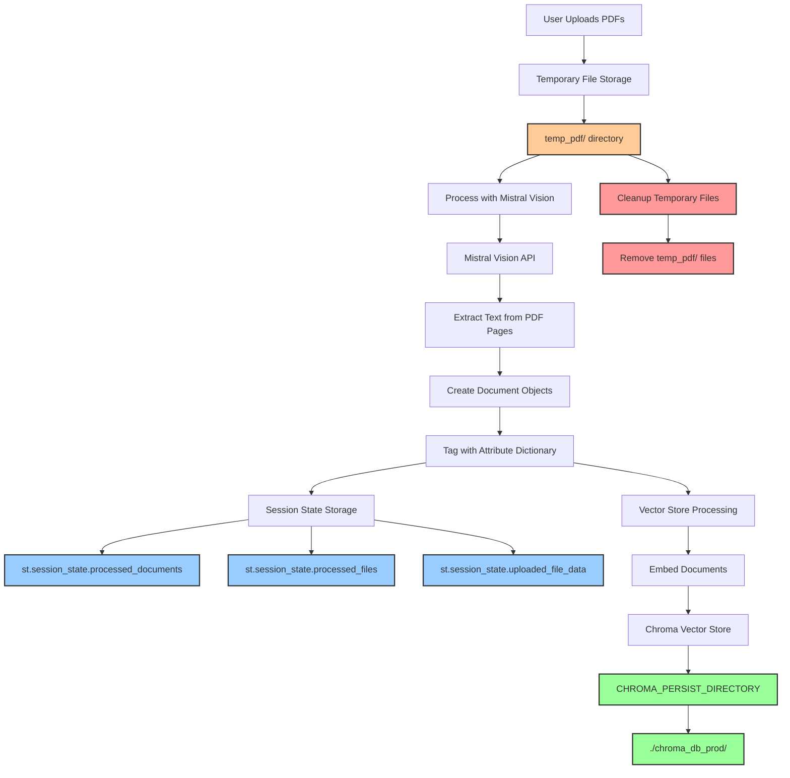

# MISTRAL EXTRACTION STORAGE DIAGRAM

## Overview
This diagram shows WHERE the Mistral-extracted PDF content is saved after processing, including all storage locations and data flow.



## DETAILED STORAGE LOCATIONS

### 1. **TEMPORARY STORAGE** (During Processing)
- **Location**: `temp_pdf/` directory
- **Content**: Original uploaded PDF files
- **Duration**: Only during processing
- **Cleanup**: Automatically removed after processing
- **Code**: `pdf_processor.py:266-275`

```python
# Save uploaded files temporarily
for uploaded_file in uploaded_files:
    file_path = os.path.join(temp_dir, file_basename)
    with open(file_path, "wb") as f:
        f.write(uploaded_file.getvalue())
```

### 2. **SESSION STATE STORAGE** (In-Memory)
- **Location**: Streamlit session state
- **Content**: Processed Document objects with extracted text
- **Duration**: Session lifetime
- **Storage**: `st.session_state.processed_documents`

```python
# Store the Mistral-extracted documents
st.session_state.processed_documents = processed_docs
st.session_state.processed_files = filenames
st.session_state.uploaded_file_data = [(f.name, f.getvalue()) for f in uploaded_files]
```

### 3. **VECTOR STORE STORAGE** (Persistent)
- **Location**: `./chroma_db_prod/` directory
- **Content**: Embedded document vectors + metadata
- **Duration**: Permanent (until manually deleted)
- **Configuration**: `CHROMA_PERSIST_DIRECTORY = "./chroma_db_prod"`

```python
# Vector store setup with persistence
vector_store = Chroma.from_documents(
    documents=documents,
    embedding=embedding_function,
    collection_name=collection_name,
    persist_directory=persist_directory  # "./chroma_db_prod"
)
```

## STORAGE TIMELINE

### Phase 1: Temporary Storage
```
1. User uploads PDFs → Save to temp_pdf/ directory
2. Process with Mistral Vision → Extract text
3. Create Document objects → Store in session state
4. Clean up temp files → Remove temp_pdf/ files
```

### Phase 2: Session Storage
```
1. Store processed_documents in session state
2. Store processed_files list in session state
3. Store uploaded_file_data for NuMind extraction
4. Keep in memory for current session
```

### Phase 3: Vector Store Storage
```
1. Embed all documents → Create vector representations
2. Store in Chroma vector store → ./chroma_db_prod/
3. Persist permanently → Available for future sessions
4. Enable similarity search → Query capabilities
```

## STORAGE DETAILS

### Temporary Files (`temp_pdf/`)
- **Purpose**: Hold uploaded PDFs during processing
- **Content**: Original PDF files
- **Lifetime**: Processing duration only
- **Cleanup**: Automatic removal after processing

### Session State (`st.session_state`)
- **processed_documents**: List of Document objects with extracted text
- **processed_files**: List of processed filenames
- **uploaded_file_data**: Original file data for NuMind extraction
- **Lifetime**: Current Streamlit session

### Vector Store (`./chroma_db_prod/`)
- **Collection**: `pdf_qa_prod_collection`
- **Content**: Document embeddings + metadata
- **Persistence**: Permanent storage
- **Access**: Available across sessions

## DATA STRUCTURE

### Document Object Structure
```python
Document(
    page_content="Extracted text from Mistral Vision",
    metadata={
        'source': 'filename.pdf',
        'page': 1,
        'Material Name': 'Copper',
        'Contact Systems': 'MCP 2.8',
        # ... other attribute tags
    }
)
```

### Vector Store Structure
```
./chroma_db_prod/
├── chroma.sqlite3          # Database file
├── index/                  # Vector index files
└── embeddings/            # Stored embeddings
```

## CLEANUP PROCESS

### Temporary File Cleanup
```python
# Clean up temporary files
for path in saved_file_paths:
    try:
        os.remove(path)
        logger.debug(f"Removed temporary file: {path}")
    except OSError as e:
        logger.warning(f"Could not remove temporary file {path}: {str(e)}")
```

### Session State Cleanup
- **Automatic**: Cleared when session ends
- **Manual**: Can be reset via `reset_evaluation_state()`
- **Persistence**: Vector store data remains permanent

## KEY STORAGE POINTS

| Storage Type | Location | Content | Duration | Purpose |
|--------------|----------|---------|----------|---------|
| **Temporary** | `temp_pdf/` | Original PDFs | Processing only | Hold files during extraction |
| **Session** | `st.session_state` | Extracted text | Session lifetime | In-memory access |
| **Vector Store** | `./chroma_db_prod/` | Embeddings + metadata | Permanent | Semantic search |

## IMPORTANT NOTES

### 1. **No Raw Text Persistence**
- The extracted text is NOT saved as raw files
- Only stored in session state (temporary) and vector store (embedded)

### 2. **Vector Store is Permanent**
- Once documents are embedded and stored, they persist across sessions
- Can be loaded with `load_existing_vector_store()`

### 3. **Session State is Temporary**
- Extracted text in session state is lost when session ends
- Need to reprocess PDFs to restore session state

### 4. **Cleanup is Automatic**
- Temporary files are automatically removed
- Session state is automatically cleared
- Vector store data remains unless manually deleted

## SUMMARY

After Mistral extraction, the PDF content is saved in **3 locations**:

1. **Temporary**: `temp_pdf/` (during processing only)
2. **Session**: `st.session_state.processed_documents` (session lifetime)
3. **Permanent**: `./chroma_db_prod/` (vector store - permanent)

The **most important storage** is the vector store, which contains the embedded representations needed for semantic search functionality. 